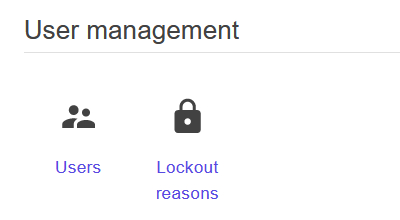
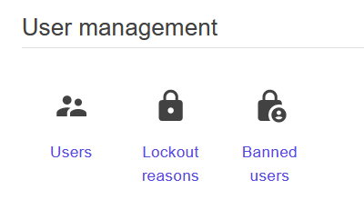

# Adding dashboard items

Sienar enables deverlopers to create dashboards for their plugins (or alter dashboards for other plugins) with the `IMenuProvider` interface. This interface is used to add items to menus *and* to add dashboard items to dashboards. This guide covers dashboards, while the previous guide covers menus.

**NOTE**: While it's possible to configure the `IMenuProvider` anywhere, it's only intended to be configured via a plugin. The behavior of configuring plugin providers outside a plugin is undefined, and will likely result in unexpected functionality. For that reason, every example will show you how to configure the `IMenuProvider` via the `ISienarPlugin.SetupDashboard()` method.

**NOTE**: A lot of the information contained in this guide assumes knowledge of several menu-related classes discussed in the previous section. If you haven't already, please read our guide on [adding menu items](/devs/guides/plugin-providers/adding-menu-items) before continuing.

## Overview

In Sienar, a "dashboard" is similar to a navigation menu. However, instead of displaying links in sidebars or appbars, a dashboard shows links grouped by category, like an app dashboard. A good example of the kind of experience you get with a Sienar dashboard is the admin interface of a cPanel application or similar, which has page-wide sections of links organized into groups.

A dashboard is more appropriate when you have a large number of items to display because dashboards have the entire page width to render, plus unlimited vertical space.

### `IMenuProvider`

The `IMenuProvider` is used to configure menus as well as dashboards. However, the primary difference in how the `IMenuProvider` is used for dashboards is that instead of accessing named *menus*, each call to `IMenuProvider.Access()` accesses a named *dashboard section*. When displaying dashboards using the `<Dashboard>` component, you need to provide a `List<string>` to the `Dashboard.Categories` parameter, which renders each given named dashboard section in definition order.

The `IMenuProvider` used to configure dashboards is a different instance than the one used to configure menus. This means you can have dashboards and menus with the same name but different contents. If you need to request the `IMenuProvider` for dashboards from the DI container, use the key `"DashboardProvider"`, which can be accessed using the `SienarBlazorUtilsServiceKeys.DashboardProvider` constant.

### `Menu`

The `Menu` is used identically in both menus and dashboards.

### `MenuPriority`

Just like with menus, the `MenuPriority` enum lets Sienar know what order to render your dashboard links in. Because sections are named based on the string provided to `IMenuProvider.Access()`, sections are sorted by changing the order of dashboard section names passed to the `Dashboard.Categories` parameter.

### `MenuLink`

The `MenuLink` class works nearly identically in both menus and dashboards. The only difference is that dashboards don't support the `Sublinks` property, which is ignored.

## Examples

The core functionality of adding menu links and dashboard links is almost identical. The only real differences are:

- instead of adding links to named menus, you add links to named dashboard sections
- the `MenuLink.Sublinks` property is ignored when using dashboards

For this reason, we're only going to show a single example that demonstrates the differences between usages in menus and dashboards. For more complete coverage of the `IMenuProvider` API, see the article on menus.

### Example 1: Adding a dashboard item

In this example, we will add a single dashboard item to the existing User Management dashboard section. The link will point to a fictional page that shows a listing of all banned users.

Before adding the icon, we see that the User Management dashboard section contains the following two links:



```csharp
using Sienar.Infrastructure; // Import DashboardMenuNames and Roles classes
using MudBlazor; // Import MudBlazor's Icons class

// ...

public void SetupDashboard(IMenuProvider dashboardProvider)
{
	dashboardProvider
    	.Access(DashboardMenuNames.Dashboards.UserManagement)
    	.AddMenuLink(
			new MenuLink
    		{
                Text = "Banned users", // Display text
                Icon = Icons.Material.Filled.LockPerson, // Link icon
                Url = "/dashboard/users/banned", // URL of page
                Roles = [Roles.Admin] // Only available to admins
			});
}
```

Now, if we build and run our application, we can see that there is a new dashboard item:

